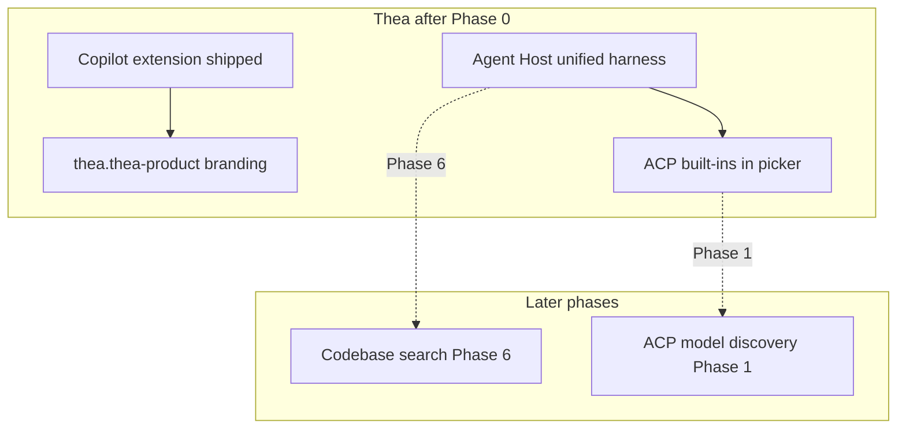
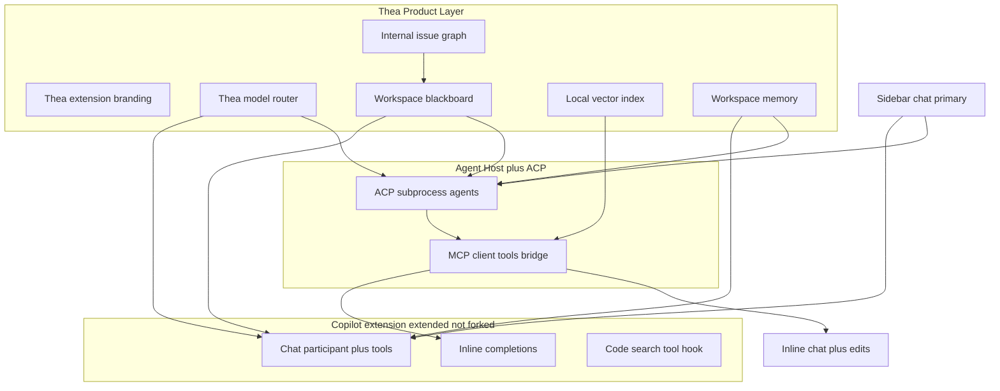

# Thea Product Roadmap

This document is the canonical product roadmap for **Thea** — a Code-OSS fork aimed at a Devin-style agentic editor with full IDE integration, Copilot-class features (extended and rebranded), and ACP-based subprocess agents.

It describes **what to build, in what order, and why** — not individual implementation tickets.

---

## Vision and principles

1. **Extend Copilot, do not fork it apart.** The GitHub Copilot Chat extension remains the backbone for chat agents, tools, inline completions, and search. Thea adds a thin product layer for branding and product-specific defaults.
2. **Sidebar chat first.** The primary agent surface is the workbench chat sidebar. The sessions window is secondary.
3. **ACP agents are first-class.** Subprocess agents speaking the Agent Client Protocol (ACP) appear in the chat model/agent picker and can drive IDE features — not just panel chat.
4. **Workspace-scoped intelligence.** Shared context (blackboard, memory, issues) lives at the workspace/repo level so parallel agents can coordinate.
5. **Local-first indexing.** Codebase semantic search uses a local vector index on repo open — no dependency on GitHub's remote index.
6. **Thea-owned routing.** "Auto" model selection uses a Thea classifier over a configurable pool (Copilot `/auto` is one backend, not the only one).

---

## Decision log

| Topic | Decision |
| ----- | -------- |
| Copilot | Utilize + extend + rebrand — keep Copilot extension; add thin Thea layer |
| ACP IDE integration | All surfaces — ghost text, inline chat, agent edits, Copilot-like features |
| Shared context | Workspace-level blackboard — all agents/sessions share a mutable pool |
| Indexing | Local-only vector store on repo open (Cursor-style) |
| Issue planning | Internal-only parent/child issue graph (no GitHub Issues sync) |
| Primary UI | Sidebar chat first; sessions window secondary |
| Model routing | Thea-owned router — classifier picks from configurable model pool |
| Wikis | Workspace agent memory — durable project knowledge (not full wiki editor v1) |
| Auth (Phase 0) | Local-first — BYOK + ACP default; GitHub Copilot subscription optional opt-in |
| Branding (Phase 0) | Thin `thea.thea-product` extension; internal chat id stays `GitHub.copilot-chat` |

---

## Current baseline

What exists in the repo today:

| Area | Status |
| ---- | ------ |
| `thea.thea-product` | Thin branding layer — welcome walkthrough, BYOK/ACP defaults, local-first setup |
| Copilot extension | **Shipped in Thea builds** (`.build/extensions/copilot/`; `compile-copilot-extension-build`) |
| `run.run-chat` | **Removed** — deleted in Phase 0; BYOK via Copilot + Agent Host harness |
| Agent Host + ACP | Built in workbench core; unified harness for sidebar chat, tools, completions, NES |
| ACP built-ins | `copilotcli`, `claude`, `codex` registered in harness picker (unsigned when allowed) |
| Client tools bridge | MCP-over-ACP → workbench tools (`acpClientBridge.ts`); shared with BYOK harness |
| Harness BYOK completions/NES | `harnessModelCompletionsService` reads harness-selected BYOK model |
| Sessions automations | Partial (simple scheduler + agent-host cron protocol) |
| Model cost hover | Partial (UBB users; empty for Auto) |
| Copilot auto routing | `AutomodeService` POST `/auto` (Copilot-only today) |

**Critical gaps today:**

- `AcpAgentProvider` exposes `models` but **never populates it** — Claude/Codex show "No models available." (Phase 1)
- **No workspace blackboard** — context is session-scoped only. (Phase 4)
- **No local vector index on repo open** — codebase search deferred to Phase 6.



---

## Logical task order (master checklist)

Tasks are grouped by phase. **Within each phase, complete bullets in order.** Do not start a phase until the previous phase milestone is met.

### Phase 0 — Foundation (Copilot + rebrand) ✅

- [x] Remove `copilot` from build exclusion in `build/lib/extensions.ts`
- [x] Point `product.json` `defaultChatAgent` at `GitHub.copilot-chat`
- [x] Build and verify Copilot extension loads (chat participant, tools, completions)
- [x] Create Thea product extension (`thea.thea-product`) for branding, welcome, and defaults
- [x] Auth path: **local-first** — BYOK + ACP without GitHub gate; GitHub optional opt-in
- [x] Remove `run.run-chat` entirely (Copilot BYOK + Agent Host harness replaces it)
- [x] Unified Agent Host harness — BYOK models and ACP session types share client tools
- [x] Harness-selected BYOK model for inline completions and next-edit (NES)
- [x] Local-first chat setup (`chatSetupRunner` + `allowSignedOutWhenUsable`)
- [x] NOTICE / licensing updates for bundled Copilot extension

**Milestone:** Sidebar chat, inline completions, and next edit work end-to-end via the Agent Host harness with BYOK (unsigned). Codebase search deferred to Phase 6. Manual GUI E2E not run in this verification pass — compile + unit tests green.

---

### Phase 1 — ACP in chat window

- [ ] Implement model discovery on `AcpAgentProvider` (`_models`, `refreshModels()`)
- [ ] Wire auth/model refresh when credentials change
- [ ] Verify model pipeline: Agent Host root state → `AgentHostChatContribution` → chat picker
- [ ] Register custom ACP agents from `chat.agentHost.acpAgents` in session type picker
- [ ] Set Thea defaults for built-in ACP agents (`acpBuiltInAgents.ts`)
- [ ] Ensure client tools are registered for ACP session types (`agentHostActiveClientService.ts`)
- [ ] Define sidebar UX: picking an ACP agent starts an agent-host session

**Milestone:** ACP agent selectable in chat → model picker populated → tools run → edits apply.

**Key files:**

- `src/vs/platform/agentHost/node/acp/acpAgentProvider.ts`
- `src/vs/workbench/contrib/chat/browser/agentSessions/agentHost/agentHostChatContribution.ts`
- `src/vs/workbench/contrib/chat/browser/agentSessions/agentHost/agentHostActiveClientService.ts`

---

### Phase 2 — ACP on all IDE surfaces

- [ ] Enable `EditorInline` for all target ACP providers (not only `copilotcli`)
- [ ] Route inline chat to selected ACP session type (`inlineChatSessionResolver.ts`)
- [ ] Parity-check agent edit session + diff preview for ACP vs Copilot CLI
- [ ] Design ghost-text bridge (`IInlineCompletionBridge` or Thea extension hook)
- [ ] Decide fast path: Copilot completions under the hood vs Thea-local model vs on-demand only
- [ ] Implement minimal Copilot extension hook for completion proxy (if needed)
- [ ] Resolve dual-agent UX when Copilot participant and ACP agent are both active

**Milestone:** From editor, ACP agent can inline-chat, apply edits, and trigger completions.

| Surface | Owner today | ACP bridge today |
| ------- | ----------- | ---------------- |
| Ghost text / tab completions | Copilot `completionsCoreContribution` | None |
| Inline chat (editor) | Agent Host, Copilot CLI only | Partial |
| Agent edits / diff session | Chat editing + Agent Host | Via client tools |

---

### Phase 3 — Thea model router + cost UI

- [ ] Add Thea router service (configurable model pool, rules-based classifier v1)
- [ ] Integrate router with sidebar chat send path
- [ ] Implement ACP `changeModel` (currently stubbed)
- [ ] Treat Copilot `/auto` as one backend inside the pool, not the only router
- [ ] Populate input/output/cache costs for BYOK and ACP models in metadata
- [ ] Extend `modelPickerHover.ts` for all models + Auto router explanation

**Milestone:** Auto picks via Thea router; hover shows full cost breakdown where data exists.

---

### Phase 4 — Workspace blackboard

- [ ] Design storage format and location (`.thea/board.json` or DB — decide)
- [ ] Implement `IWorkspaceAgentBoardService` (CRUD, workspace-scoped)
- [ ] Add agent tools: read/write/search board entries
- [ ] Inject summarized board context into Copilot + ACP prompts
- [ ] Add concurrency control (versioning / section locks)
- [ ] Optional: sidebar board panel

**Milestone:** Two parallel agents read/write shared board without lost updates.

---

### Phase 5 — Internal issue graph

- [ ] Define `TheaIssue` model (parent/child, status, agent context refs)
- [ ] Build issue tree UI in sidebar (primary surface)
- [ ] Implement context inheritance: child agents receive parent context + board slice
- [ ] Add agent tools: `create_issue`, `update_issue`, `link_issues`, `spawn_agent_for_issue`
- [ ] Link issues to blackboard entries (requires Phase 4)

**Milestone:** Plan splits into parent/child issues; child agents inherit context.

---

### Phase 6 — Local codebase indexing

- [ ] Choose embedding model + vector store (local API key or bundled — decide)
- [ ] Implement chunking pipeline (files, symbols, `.gitignore` respect)
- [ ] Trigger index on workspace open; incremental updates on file change
- [ ] Add status bar progress UI
- [ ] Expose semantic search agent tool (Thea-owned, no GitHub remote index)
- [ ] Wire tool into ACP client tools + Copilot agent tool sets

**Milestone:** Open repo → index builds → agent semantic search works offline.

---

### Phase 7 — Code walking

- [ ] Add "Walk implementation" command on selection
- [ ] Pipeline: language service (defs/refs/call hierarchy) + optional index (Phase 6)
- [ ] Structured output: ordered steps (define → callers → usage)
- [ ] UI: stepper or threaded chat with jump-to-definition anchors

**Milestone:** Highlight symbol → walk produces ordered steps with linked navigation.

---

### Phase 8 — Better planning (Superpowers-style)

- [ ] Add Thea planning mode in sidebar (brainstorm → review → approve)
- [ ] Gate edit tools until plan approved
- [ ] On approval, auto-generate Phase 5 issue tree from plan
- [ ] Integrate with existing plan review UI (`chatPlanReviewPart.ts`)
- [ ] Optional: Thea skills / superpowers-style prompt packs

**Milestone:** Approved plan unlocks edits and spawns linked issues.

---

### Phase 9 — Cron automations

- [ ] Unify sessions automations + agent-host automation catalog
- [ ] Expose automation CRUD from sidebar (not only sessions window)
- [ ] Enable cron + timezone via agent host (`agentHostAutomationService.ts`)
- [ ] Add run history, failure notifications, workspace-closed guard
- [ ] **Deferred:** webhook / event triggers

**Milestone:** User schedules recurring agent run from sidebar.

---

### Phase 10 — Workspace agent memory

- [ ] Create workspace-scoped memory store (`.thea/memory/` — separate from session chronicle)
- [ ] Agent tools: `remember`, `recall`, `forget` with tags
- [ ] Prompt injection rules for all agents (Copilot + ACP)
- [ ] Optional: memory browser in sidebar

**Milestone:** Fact saved once is recalled by all agents in repo.

---

## Dependency chain

```
Phase 0 → Phase 1 → Phase 2
Phase 0 → Phase 3
Phase 4 → Phase 5 → Phase 8
Phase 6 → Phase 7
Phase 0 → Phase 9
Phase 4 → Phase 10 (optional overlap with Phase 5)
```

---

## Architecture target (end state)



---

## Feature deep-dives

### ACP agents in the IDE

**Goal:** ACP agents appear in the chat window and can use inline completions, inline chat, and agentic edits.

**Exists:** ACP transport, session manager, event mapper, client tools bridge, built-in agent definitions, Agent Host chat contribution.

**Gaps:** Empty model list on `AcpAgentProvider`; no ghost-text bridge; `EditorInline` only for `copilotcli`; stubbed `changeModel`.

**Approach:** Phase 1 fixes picker/models; Phase 2 bridges IDE surfaces; prefer workbench + Thea extension hooks over splitting Copilot.

**Open questions:**

- Which ACP agents are Thea built-in defaults vs user-configured only?
- Ghost text: Copilot API under the hood vs Thea-local model vs on-demand only?
- Who owns the session when Copilot participant and ACP agent are both active?

---

### Context sharing (workspace blackboard)

**Goal:** Devin-style shared pool — any agent can read/write workspace context for parallel work.

**Exists:** Session server tools (`get_session_context`, `send_message`, `create_session`); peer chats within a session; subagent hierarchy.

**Gaps:** No global blackboard; `send_message` is fire-and-forget; no push/subscribe between agents.

**Approach:** New `IWorkspaceAgentBoardService` + agent tools + prompt injection; optional sidebar panel.

**Open questions:**

- Storage: `.thea/board.json` vs SQLite vs cloud sync?
- Human-editable vs agent-only?
- Merge with Copilot `/memories/` or keep separate?

---

### Internal issue planning

**Goal:** Parent/child issues with shared context inheritance (GitHub-style, internal only).

**Exists:** GitHub issue attach for sessions (external); Copilot plan mode (`plan.md`); per-session todo tool.

**Gaps:** No internal issue graph; no parent→child context inheritance; no issue tree UI in sidebar.

**Approach:** `TheaIssue` model + sidebar tree + spawn agents per issue + link to blackboard.

**Open questions:**

- One agent per issue vs many?
- Issue lifecycle states and who transitions them?
- Export format or internal forever?

---

### Wikis / workspace memory

**Goal:** Durable project knowledge maintained by agents.

**Exists:** Copilot memory tool (`/memories/`); Chronicle session store (session-scoped).

**Gaps:** No repo-level memory store or UI.

**Approach:** `.thea/memory/` + remember/recall tools + prompt injection (Phase 10).

---

### Code walking

**Goal:** Walk through highlighted code — explain implementation and system usage.

**Exists:** `/explain` intent; search/explore subagents (chat prose, not structured walk).

**Gaps:** No stepper UI; no call-graph-guided walk command.

**Approach:** Thea command + language service + optional index (Phase 6) + anchored UI (Phase 7).

---

### Automations (cron / webhook)

**Goal:** Scheduled and event-driven agent runs.

**Exists:** Sessions scheduler; agent-host cron + protocol stubs for webhooks.

**Gaps:** Two parallel systems; webhooks unimplemented; CRUD mostly in sessions window.

**Approach:** Unify catalogs; sidebar CRUD; cron first (Phase 9); webhooks later.

---

### Local codebase indexing

**Goal:** Vector index on first repo open; semantic search without GitHub remote index.

**Exists:** Copilot `workspaceChunkSearch` (lazy, often remote).

**Gaps:** No Thea-owned index-on-open; no offline-first path.

**Approach:** New Thea indexing service + agent search tool (Phase 6).

**Open questions:**

- Embedding model source (bundled vs API key)?
- Multi-root workspace behavior?
- Reindex policy for large repos?

---

### Dynamic model routing

**Goal:** "Auto" routes to best model from configurable pool.

**Exists:** Copilot `AutomodeService` (POST `/auto`); agent-host Auto model for Copilot CLI.

**Gaps:** No Thea-owned router across Copilot + BYOK + ACP; multi-turn routing not wired.

**Approach:** Thea router service; Copilot `/auto` as one backend (Phase 3).

**Open questions:**

- Router inputs: prompt only vs tools + file context + budget?
- Per-user allowlist vs org policy?

---

### Model inspecting (cost hover)

**Goal:** Hover on model picker shows input, output, and cache costs.

**Exists:** `modelPickerHover.ts` with UBB cost table for named Copilot models.

**Gaps:** Auto hides costs; BYOK/ACP often missing; non-UBB users see multiplier only.

**Approach:** Populate metadata for all vendors; extend hover for Auto router explanation (Phase 3).

---

### Better planning (Superpowers-style)

**Goal:** Plan-before-code with approval gates and issue spawning.

**Exists:** Plan agent, plan review UI, manage_todo_list, plan mode in Copilot CLI.

**Gaps:** No enforced gates; no auto-issue-tree from approved plan.

**Approach:** Thea planning mode + tool lock until approved + Phase 5 integration (Phase 8).

---

## Risk register

| Risk | Impact | Mitigation |
| ---- | ------ | ---------- |
| ACP "all surfaces" scope creep | Phase 2 blocks on ghost-text bridge design | Time-box bridge design; ship inline chat + edits before ghost text |
| Copilot merge burden | Fork drifts from upstream | Extend, don't split; minimal Copilot patches |
| Blackboard concurrency | Parallel agents clobber shared state | Versioning/ETags from day one |
| Local index cost | Large repos slow to index | Background indexing + user consent + incremental updates |
| Dual automation systems | Confusing UX | Unify in Phase 9 before adding webhooks |
| Licensing/branding | Copilot identity vs Thea product | Decide in Phase 0; document in NOTICE |

---

## Explicit non-goals (v1)

- Splitting Copilot into many extensions
- Bidirectional GitHub Issues sync
- Webhook automations (until cron is stable)
- Full wiki editor with page graph
- Replacing Copilot completions core entirely

---

## Open questions backlog

| # | Question | Phase | Status |
| - | -------- | ----- | ------ |
| 1 | Copilot UI branding vs extension identity | 0 | **Resolved** — thin `thea.thea-product` layer; extension id stays `GitHub.copilot-chat` |
| 2 | GitHub auth required vs BYOK-only users | 0 | **Resolved** — local-first; BYOK + ACP default; GitHub optional |
| 3 | Default ACP agents shipped with Thea | 1 | Open |
| 4 | Sidebar picks ACP → auto-start agent-host session? | 1 | Open |
| 5 | Ghost text fast path architecture | 2 | Open |
| 6 | Blackboard storage format | 4 | Open |
| 7 | Blackboard vs Copilot memory merge? | 4 / 10 | Open |
| 8 | Embedding model for local index | 6 | Open |
| 9 | Mandatory planning mode vs opt-in | 8 | Open |
| 10 | Router inputs and policy | 3 | Open |

---

## Immediate next steps

1. **Phase 1:** Fix `AcpAgentProvider` model listing (unblocks ACP model picker population).
2. **Phase 6:** Local codebase indexing (semantic search deferred from Phase 0 milestone).
3. **Parallel:** Design doc for Phase 2 ghost-text bridge (highest technical uncertainty).

---

## Related code references

| Topic | Path |
| ----- | ---- |
| Build / Copilot bundle | `build/lib/extensions.ts`, `build/gulpfile.extensions.ts` |
| Product config | `product.json` |
| Thea product extension | `extensions/thea-product/` |
| Copilot harness completions | `extensions/copilot/src/extension/completions/vscode-node/harnessModelCompletionsService.ts` |
| ACP provider | `src/vs/platform/agentHost/node/acp/` |
| Agent Host chat bridge | `src/vs/workbench/contrib/chat/browser/agentSessions/agentHost/` |
| Copilot LM access | `extensions/copilot/src/extension/conversation/vscode-node/languageModelAccess.ts` |
| Copilot completions | `extensions/copilot/src/extension/completions/` |
| Model picker hover | `src/vs/workbench/contrib/chat/browser/widget/input/modelPicker/modelPickerHover.ts` |
| Automations | `src/vs/sessions/contrib/automations/`, `src/vs/platform/agentHost/node/agentHostAutomationService.ts` |
| Agent Host design doc | `src/vs/platform/agentHost/AGENTS.md` |
